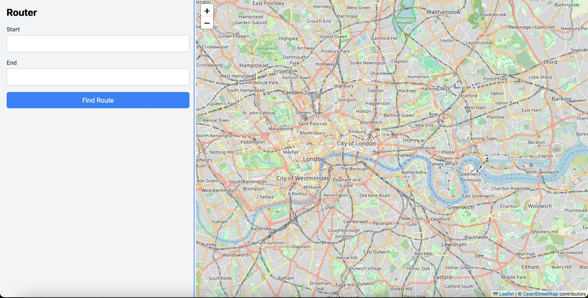

# Route Mate

Route Mate is a navigation platform designed to provide optimal routing solutions, real-time traffic updates, and seamless user experiences through interactive map integration. Built with a powerful tech stack, Route Mate ensures efficient and reliable navigation for users across various environments.

## Features

- Interactive Map Integration: Utilizes Leaflet and OpenStreetMap for real-time geospatial data visualization.
- Optimal Route Planning: Predicts traffic and suggests the most efficient routes.
- Real-Time Updates: Ensures dynamic and accurate navigation based on current traffic conditions.
- Scalable and Reliable Backend: Robust backend architecture to handle high user demand.

## Tech Stack
Frontend: React

Backend: Flask

Database: PostgreSQL

Mapping Tools: Leaflet, OpenStreetMap

Machine Learning: TensorFlow

Client-Server Communication: Axios

Deployment: Docker

## Contributing
We welcome contributions! Follow these steps to contribute:
- Fork the repository.
- Create a new branch for your feature or bug fix.
- Commit your changes and submit a pull request.

## License
This project is licensed under the MIT License. See the LICENSE file for details.

## Acknowledgments
Leaflet and OpenStreetMap for providing reliable mapping tools.
TensorFlow for predictive analytics capabilities.
Docker for streamlined deployment.

